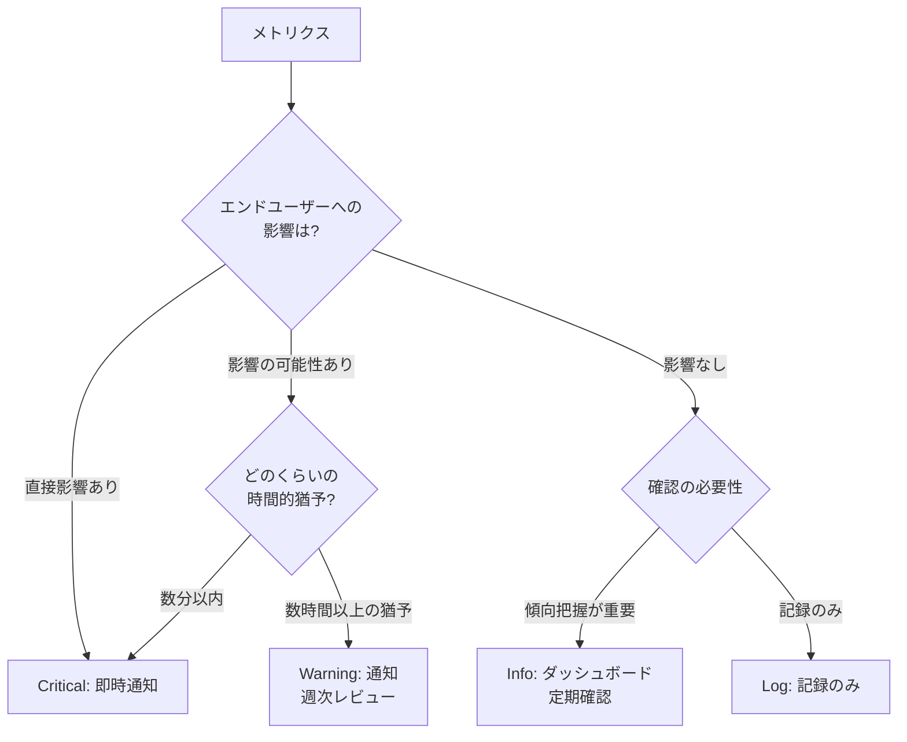

# アラートレベルの決め方

アラートの重要度を適切に設定することで、効果的なインシデント対応が可能になります。

## アラートレベルの定義

### Critical（高）

**エンドユーザーに影響がある、または即座に影響が出る状況**

- **通知手段**: PagerDuty、電話、SMS
- **対応時間**: 即時（5分以内）
- **対応者**: オンコールエンジニア
- **エスカレーション**: 15分以内に対応開始されない場合、上位者へ自動エスカレーション

**例:**

- API Gatewayのエラー率が5%を超える
- ALBの全てのターゲットがUnhealthy
- RDSへの接続が失敗する

### Warning（中）

**エンドユーザーへの影響が顕在化する前の段階、傾向や予兆の把握**

- **通知手段**: Slack、メール
- **対応時間**: 基本は週次/月次レビュー時、システム特性により翌営業日〜数日以内
- **対応者**: 運用チーム、開発チーム
- **エスカレーション**: なし（レビュー時に対応計画を立てる）

**例:**

- EC2のCPU使用率が80%を15分間継続
- Lambda関数のエラー率が1%を超える
- DynamoDBの読み込みキャパシティ使用率が80%を超える

**対応時間の判断基準:**

- **週次/月次レビュー時で十分なケース（推奨）**:
  - 安定稼働しているシステム
  - Auto Scaling設定済み
  - 通常運用時

- **翌営業日〜数日以内の対応が必要なケース**:
  - 急成長中のサービス
  - イベント前（セール、キャンペーン）
  - 過去に問題があったシステム

### Info（低）

**長期的な傾向監視や情報共有のため、通知は不要**

- **確認手段**: CloudWatch ダッシュボード、Grafana等で定期確認
- **確認タイミング**: 朝会、週次/月次レビュー時
- **対応者**: 開発チーム全体
- **ワークフロー**: チームでダッシュボードを見る習慣を作る

**例:**

- S3バケットの容量推移
- CloudWatch Logsのワーニング発生傾向
- バッチ処理の実行時間推移
- API呼び出し回数のトレンド

**ダッシュボード活用のメリット:**

- **コンテキストが豊富**: 複数のメトリクスを関連付けて理解できる
- **ノイズ削減**: 通知に依存しないので、アラート疲れを防げる
- **チーム全体の理解**: 定期的に確認することでシステムの状態を把握できる

### Log（記録のみ）

**記録のみ、通知やダッシュボード表示も不要**

- **確認手段**: CloudWatch Logs Insights等で必要時に検索
- **確認タイミング**: トラブルシューティング時、監査時
- **対応者**: なし

**例:**

- 通常の処理完了ログ
- デバッグ情報
- 統計情報

## レベル設定の判断基準

### 1. エンドユーザー影響の有無

最も重要な判断基準です。



### 2. 影響範囲の大きさ

- **全サービス停止**: Critical
- **一部機能の停止**: Critical または Warning
- **特定ユーザーのみ**: Warning
- **影響なし**: Info または Log

### 3. 確認・対応の方法

- **即座の対応が必要**: Critical（プッシュ通知）
- **定期的な傾向把握**: Warning（プッシュ通知、週次レビュー）
- **長期的な傾向監視**: Info（ダッシュボードでプル型確認）
- **必要時のみ確認**: Log（検索で確認）

## 実践的な設定例

### API Gateway エラー率

```
エラー率 > 5%（5分間継続）: Critical（即時通知）
エラー率 > 1%（5分間継続）: Warning（通知、週次レビュー）
エラー率の推移: Info（ダッシュボード表示）
```

### EC2 CPU使用率（Auto Scaling設定済み）

```
CPU > 90%（5分間継続）かつ Auto Scaling失敗: Critical
CPU > 80%（15分間継続）: Warning（通知、週次レビュー）
CPU使用率の推移: Info（ダッシュボード表示）
```

### RDS 接続数

```
接続数 > 最大接続数の95%: Critical
接続数 > 最大接続数の80%: Warning（通知、週次レビュー）
接続数の推移: Info（ダッシュボード表示）
```

## Infoレベルのダッシュボード活用

### ダッシュボードの構成例

**システムヘルスダッシュボード:**

- リソース使用率の推移（CPU、メモリ、ディスク）
- エラー率の推移
- レスポンスタイムの推移
- リクエスト数の推移

**確認のワークフロー:**

1. **朝会での確認**: 前日の主要メトリクスをざっと確認
2. **週次レビュー**: 1週間の傾向を分析、改善点を議論
3. **月次レビュー**: キャパシティプランニング、コスト最適化の検討

## よくある失敗パターン

### 1. 全てをCriticalにする

**問題**: アラート疲れ（Alert Fatigue）が発生し、重要なアラートを見逃す

**対策**: エンドユーザー影響を基準に優先度を設定する

### 2. InfoレベルをSNS通知にする

**問題**:

- 大量の通知でSlackやメールが埋まる
- 本当に重要な情報が埋もれる
- チームメンバーが通知を無視するようになる

**対策**: Infoレベルはダッシュボードで定期確認する運用にする

### 3. WarningやInfoに過度に迅速な対応を求める

**問題**:

- 継続的な割り込みで開発生産性が低下
- 本当に重要なCriticalアラートへの感度が下がる
- 持続可能な運用ができない

**対策**:

- 基本は週次/月次レビュー時の対応とする
- システム特性に応じて柔軟に判断する

### 4. 閾値が低すぎる

**問題**: 誤検知が多発し、信頼性が低下する

**対策**: 過去のデータを分析し、適切な閾値を設定する

### 5. 評価期間が短すぎる

**問題**: 一時的なスパイクで不要なアラートが発生する

**対策**: 適切な評価期間を設定する（例: 5分間継続、3回連続）

## 設定の見直し

アラートレベルは定期的に見直しが必要です。

### 見直しのタイミング

- Criticalアラートが発生した時（適切だったか評価）
- システム構成変更時
- 週次/月次のレビュー時

### 見直しの観点

- 誤検知の頻度
- 見逃しの有無
- 対応時間の妥当性
- エスカレーションの適切性
- WarningやInfoが本当に有用か
- ダッシュボードは定期的に確認されているか

### ポストモーテムでのアラート評価

Criticalアラートが発生しインシデント対応を行った後は、ポストモーテム（振り返り）でアラートの有効性を評価します。

**評価すべき観点:**

- アラートは適切なタイミングで発火したか？（早すぎ/遅すぎ）
- アラートを受けて具体的なアクションを起こせたか？
- 必要な情報（ログへのリンク、影響範囲など）が通知に含まれていたか？
- 適切な人に通知されたか？
- 今回検知できなかった問題はなかったか？

**ポストモーテムの成果物（アラート関連）:**

| 成果物 | 内容 |
|-------|------|
| 閾値の調整 | 早すぎた/遅すぎた場合に閾値を見直す |
| 新規アラートの追加 | 今回検知できなかった問題を検知するアラートを追加 |
| 不要アラートの削除 | 対応に役立たなかったアラートを削除またはレベル変更 |
| ランブックの更新 | 対応手順が不明確だった場合に整備 |
| 通知内容の改善 | 必要な情報が不足していた場合に追加 |

**ポイント:**

- ポストモーテムは「誰が悪かったか」ではなく「システムをどう改善するか」に焦点を当てる
- アラートの改善は必ずアクションアイテムとして記録し、実行する
- 同じ問題で再度インシデントが発生した場合は、前回のポストモーテムが活かされているか確認する

## まとめ

- エンドユーザー影響を最優先の判断基準にする
- **Critical**: 即時対応（プッシュ通知）
- **Warning**: 基本的に週次/月次レビュー時対応（プッシュ通知）
- **Info**: ダッシュボードでプル型確認（通知なし）
- **Log**: 記録のみ（必要時に検索）
- システム特性に応じて柔軟に判断する
- ダッシュボードを活用した定期確認のワークフローを作る
- 定期的に見直しと改善を行う
