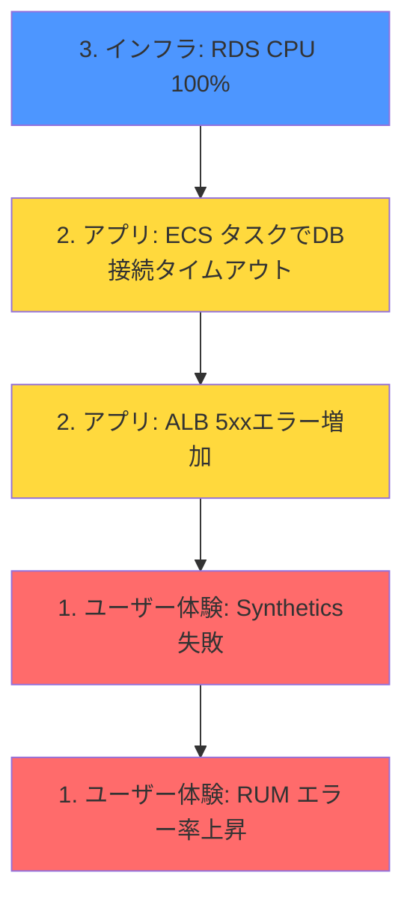
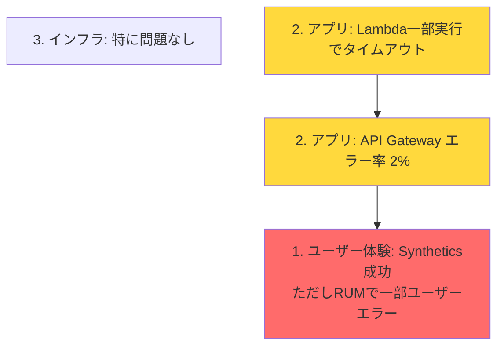
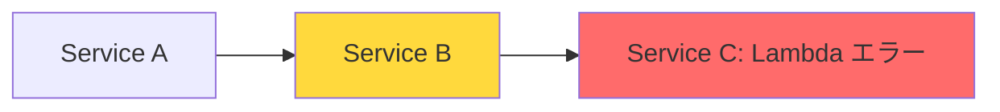

# 多層モニタリングの実践例

具体的なシステム構成における多層モニタリングの実装例を紹介します。

## 例1: Webアプリケーション（ECS + RDS構成）

### システム構成

```
Internet → ALB → ECS (Fargate) → RDS (PostgreSQL)
```

### 各レイヤーのモニタリング設定

#### 1. ユーザー体験レイヤー

**CloudWatch Synthetics（Canary）**

- **監視内容**: トップページ、ログイン、主要機能へのアクセス
- **頻度**: 5分間隔
- **アラート**: Canary失敗 → Critical

```
目的: エンドユーザー視点でサービス全体が正常に動作しているか
```

**CloudWatch RUM**

- **監視内容**: 実ユーザーのページロードタイム、JSエラー
- **アラート**: エラー率 > 5% → Critical

```
目的: 実際のユーザーが体験している品質を把握
```

#### 2. アプリケーションレイヤー

**API Gateway / ALB メトリクス**

- **監視内容**: レスポンスタイム、エラー率（4xx, 5xx）
- **アラート**:
  - 5xxエラー率 > 5% → Critical
  - 5xxエラー率 > 1% → Warning

```
目的: アプリケーションレベルでのエラーを検知
```

**ECS メトリクス**

- **監視内容**: タスク数、CPU/メモリ使用率
- **アラート**:
  - 全タスク停止 → Critical
  - CPU > 80%（15分間継続） → Warning

```
目的: コンテナの健全性を確認
```

**CloudWatch Logs**

- **監視内容**: アプリケーションログ、エラーパターン
- **アラート**:
  - ERROR レベルログが急増 → Warning

```
目的: アプリケーション内部のエラーを検知
```

#### 3. インフラストラクチャレイヤー

**ALB メトリクス**

- **監視内容**: TargetHealth、UnhealthyHostCount
- **アラート**:
  - 全ターゲットUnhealthy → Critical
  - 一部ターゲットUnhealthy → Warning

```
目的: 個々のターゲットの健全性を確認（Syntheticsでは検知できない部分的な障害を検知）
```

**RDS メトリクス**

- **監視内容**: CPU、接続数、ストレージ、レプリケーション遅延
- **アラート**:
  - 接続失敗 → Critical
  - CPU > 90%（5分間継続） → Critical
  - 接続数 > 80% → Warning

```
目的: データベースのリソース状態を監視
```

### レイヤー間の関連性

**障害発生時の検知フロー例:**



**検知順序と原因特定:**

1. **最初の検知**: RDS CPU使用率が100%（Warning）
2. **影響拡大**: ECSタスクでDB接続タイムアウト（Warning）
3. **ユーザー影響**: ALB 5xxエラー増加（Critical）
4. **確認**: Synthetics失敗（Critical）

→ 多層監視により、ユーザー影響が出る前の段階（RDS CPU高騰）で予兆を検知できる

## 例2: サーバーレス構成（API Gateway + Lambda + DynamoDB）

### システム構成

```
Internet → API Gateway → Lambda → DynamoDB
```

### 各レイヤーのモニタリング設定

#### 1. ユーザー体験レイヤー

**CloudWatch Synthetics**

- **監視内容**: API エンドポイントへのリクエスト
- **頻度**: 5分間隔
- **アラート**: Canary失敗 → Critical

#### 2. アプリケーションレイヤー

**API Gateway メトリクス**

- **監視内容**: レスポンスタイム、エラー率
- **アラート**:
  - 5xxエラー率 > 5% → Critical
  - 4xxエラー率 > 10% → Warning

**Lambda メトリクス**

- **監視内容**: 実行時間、エラー、スロットリング、同時実行数
- **アラート**:
  - エラー率 > 5% → Critical
  - スロットリング発生 → Critical
  - 実行時間が平均の2倍 → Warning

**X-Ray**

- **監視内容**: 分散トレーシング、レイテンシ分析
- **アラート**:
  - エラー率上昇 → Warning

#### 3. インフラストラクチャレイヤー

**DynamoDB メトリクス**

- **監視内容**: スロットリング、読み書きキャパシティ使用率
- **アラート**:
  - スロットリング発生 → Critical
  - キャパシティ使用率 > 80% → Warning

### 部分的な障害の検知例

**シナリオ**: Lambda関数の一部の実行環境でコールドスタート時にタイムアウト



**この例でのポイント:**

- Synthetics（定期的な監視）は成功
- しかし、Lambda エラーメトリクスでタイムアウトを検知（Warning）
- RUMで実ユーザーの一部がエラーを体験していることを確認（Critical）

→ 多層監視により、Syntheticsだけでは見逃す「部分的な障害」を検知できる

## 例3: マイクロサービス構成

### システム構成

```
Internet → ALB → Service A (ECS)
                    ↓
                 Service B (ECS) → RDS
                    ↓
                 Service C (Lambda) → DynamoDB
```

### 各レイヤーのモニタリング設定

#### 1. ユーザー体験レイヤー

**CloudWatch Synthetics**

- **監視内容**: エンドツーエンドのシナリオ（複数サービスを跨ぐ処理）
- **アラート**: Canary失敗 → Critical

#### 2. アプリケーションレイヤー

**各サービスのメトリクス**

- Service A, B, C それぞれで監視
- サービス間の依存関係も監視

**X-Ray**

- **監視内容**: サービス間の呼び出し、依存関係、レイテンシ
- **アラート**:
  - 特定サービスのエラー率上昇 → Warning
  - サービス間呼び出しのタイムアウト → Critical

```
目的: どのサービスがボトルネックになっているか特定
```

#### 3. インフラストラクチャレイヤー

**各サービスのインフラメトリクス**

- ECS タスク、Lambda、RDS、DynamoDB それぞれ監視

### サービス間障害の検知例

**シナリオ**: Service Cの障害がService Bに影響



**検知フロー:**

1. **3. インフラ**: DynamoDB スロットリング（Warning）
2. **2. アプリ**: Service C (Lambda) エラー率上昇（Warning）
3. **2. アプリ**: Service B でService C呼び出しタイムアウト（Warning）
4. **2. アプリ**: Service B エラー率上昇（Critical）
5. **1. ユーザー体験**: Synthetics失敗（Critical）

→ X-Rayの分散トレーシングにより、Service Cが根本原因であることを迅速に特定

## 多層モニタリングのベストプラクティス

### 1. 上位レイヤーから設計する

まずエンドユーザー視点（Synthetics、RUM）を設定し、次にアプリケーション、最後にインフラを設定します。

### 2. 各レイヤーで適切なアラートレベルを設定

- **ユーザー体験レイヤー**: Critical（即時対応）
- **アプリケーション・インフラレイヤー**: Warning（週次レビュー、または翌営業日対応）

### 3. 冗長性を持たせる

「Syntheticsで監視しているから他は不要」ではなく、各レイヤーで異なる視点から監視します。

### 4. レイヤー間の相関を理解する

障害発生時に、どのレイヤーから問題が始まったかを追跡できるようにします。

### 5. ダッシュボードで全体を可視化する

各レイヤーのメトリクスを一つのダッシュボードに集約し、定期的に確認します。

## まとめ

- 各レイヤーで異なる視点・粒度で監視する
- Syntheticsだけでは検知できない部分的な障害も、多層監視で検知可能
- 予兆段階での検知により、ユーザー影響を最小化できる
- レイヤー間の相関を理解することで、迅速な根本原因の特定が可能
- 適切なアラートレベルを設定し、アラート疲れを防ぐ
