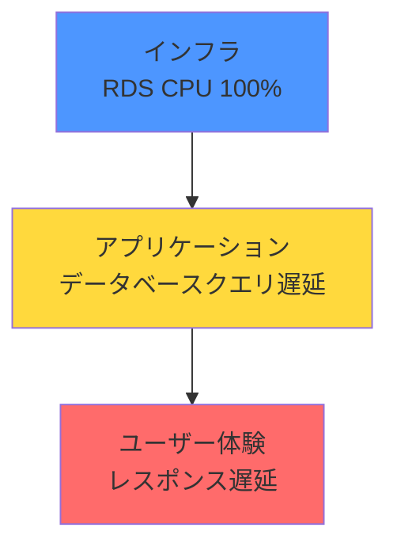

# 多層モニタリングとは

システムを多層的に監視することで、問題の早期発見と迅速な原因特定が可能になります。

## 多層モニタリングの必要性

### なぜ多層的に監視するのか

システムは複数のレイヤーで構成されており、問題は様々なレイヤーで発生します。単一のレイヤーだけを監視していては:

- **問題の見逃し**: 別のレイヤーで発生した問題を検知できない
- **原因特定の遅れ**: どのレイヤーに問題があるのか分からない
- **対症療法**: 根本原因ではなく表面的な症状にしか対処できない

多層的に監視することで、**問題の早期発見**と**迅速な根本原因の特定**が可能になります。

### 重複ではなく、異なる視点での監視

「Syntheticsで死活監視しているから、ALBのHealthCheckは不要」という考え方は誤りです。

**各レイヤーは異なる視点・粒度で監視する必要があります:**

- **Synthetics**: 外部からエンドユーザー視点でサービス全体が正常か確認
- **ALB HealthCheck**: 各ターゲットインスタンスが個別に応答しているか確認

**多層監視のメリット:**

- **検知漏れを防ぐ**: Syntheticsが成功しても、一部のターゲットがUnhealthyになっている可能性がある
- **原因特定が早い**: 問題がどのレイヤーで発生しているか即座に判断できる
- **冗長性**: 一つの監視が失敗しても、別のレイヤーで検知できる

## モニタリングの3つのレイヤー

### 1. ユーザー体験レイヤー

**エンドユーザーが実際に体験するサービスの品質**

監視対象:
- レスポンスタイム
- エラー率
- 可用性
- 機能の正常動作

AWS サービス例:
- CloudWatch Synthetics（合成モニタリング）
- CloudWatch RUM（Real User Monitoring）
- X-Ray（分散トレーシング）

**監視の特徴:**
- エンドユーザー視点での監視
- サービス全体の健全性を確認
- 外部からのアクセスで検証

### 2. アプリケーションレイヤー

**アプリケーションコードの動作と処理**

監視対象:
- APIのレスポンスタイム
- エラー・例外の発生
- トランザクション処理
- ビジネスロジックの実行状況

AWS サービス例:
- API Gateway メトリクス
- Lambda メトリクス
- X-Ray（APM）
- CloudWatch Logs

**監視の特徴:**
- アプリケーション内部の動作を確認
- どの処理でエラーが発生しているか特定
- パフォーマンスボトルネックの検出

### 3. インフラストラクチャレイヤー

**システムを支えるインフラの健全性**

監視対象:
- CPU、メモリ、ディスク使用率
- ネットワークトラフィック
- データベース接続数
- キャッシュヒット率
- ヘルスチェック状態

AWS サービス例:
- EC2 メトリクス
- RDS メトリクス
- ElastiCache メトリクス
- ALB メトリクス、TargetHealth

**監視の特徴:**
- インフラリソースの状態を確認
- リソース逼迫の予兆を検知
- 個々のコンポーネントの健全性を確認

## レイヤー間の関連性

問題は下位レイヤー（インフラ）から上位レイヤー（ユーザー体験）へ伝播します。多層的に監視することで、迅速に根本原因を特定できます。



### 例: レスポンス遅延の原因調査

**問題の発生と影響の伝播:**

1. **根本原因（インフラ）**: RDS のCPU使用率が100%に張り付き
2. **影響（アプリケーション）**: データベースクエリが遅延し、API Gatewayで決済APIのレスポンスタイムが9秒
3. **影響（ユーザー体験）**: Syntheticsで決済ページのレスポンスタイムが10秒以上

→ インフラの問題がアプリケーション、ユーザー体験へと伝播

### 例: 可用性の問題調査

**問題の発生と影響の伝播:**

1. **根本原因（インフラ）**: ALBのTargetHealthで2台中1台がUnhealthy（EC2インスタンス1台の障害）
2. **影響（アプリケーション）**: API Gatewayのエラー率が上昇（一部リクエストが失敗）
3. **影響（ユーザー体験）**: 一部ユーザーがエラーを体験（Syntheticsは成功したが、部分的な障害）

→ インフラの問題（1台障害）がアプリケーション、ユーザー体験へと部分的に影響

この例では、**Syntheticsだけでは検知できなかった部分的な障害を、ALBのHealthCheckで検知**できています。

## 各レイヤーの優先度とアラート設定

### Critical（高）: ユーザー体験レイヤー

エンドユーザーに直接影響するため、最優先で監視・対応が必要です。

**アラート例:**
- Syntheticsの失敗
- Real User Monitoring でのエラー率5%超過
- レスポンスタイムがSLOを違反

### Warning（中）: アプリケーション・インフラレイヤー

ユーザー体験に影響が出る前の予兆段階で検知します。

**アラート例:**
- API Gateway のエラー率1%超過
- Lambda の実行時間が平均の2倍
- RDS の接続数が80%超過
- ALBのTargetがUnhealthy（ただし他のターゲットは正常）

**対応:**
- 基本は週次/月次レビュー時
- システム特性により翌営業日〜数日以内

### Info（低）: 長期的な傾向監視

ダッシュボードで定期確認し、傾向を把握します。

**確認内容:**
- リソース使用率の推移
- エラー発生パターンの傾向
- パフォーマンスの変化

**確認方法:**
- 朝会、週次でのダッシュボード確認

## 多層モニタリングの実践

### 1. 上位レイヤーから設計する

**エンドユーザー視点（ユーザー体験レイヤー）から設計を開始**します。

```
ユーザー体験 → アプリケーション → インフラ
```

### 2. 各レイヤーで異なる視点を持つ

同じ「可用性」を監視する場合でも、各レイヤーで異なる視点を持ちます。

| レイヤー | 監視内容 | 検知できること |
|---------|---------|---------------|
| ユーザー体験 | Synthetics | サービス全体が利用可能か |
| アプリケーション | API Gateway エラー率 | APIレベルでのエラー発生 |
| インフラ | ALB TargetHealth | 個々のインスタンスの状態 |

### 3. レイヤー間の相関を理解する

問題発生時に、どのレイヤーがどのように影響し合うかを理解します。

**問題調査のフロー:**

```
ユーザー体験: 何が起きているか？
      ↓
アプリケーション: どのAPIが影響を受けているか？
      ↓
インフラ: どのリソースに問題があるか？
```

### 4. 適切なアラートレベルを設定する

各レイヤーのアラートに適切な優先度を設定します。

| レイヤー | 優先度 | 理由 |
|---------|--------|------|
| ユーザー体験 | Critical | エンドユーザー直接影響 |
| アプリケーション | Warning | 予兆段階での検知 |
| インフラ | Warning | 予兆段階での検知 |

## まとめ

- システムは複数のレイヤーで構成されており、各レイヤーを監視する必要がある
- 各レイヤーは異なる視点・粒度で監視し、重複ではなく補完関係にある
- Syntheticsで死活監視していても、ALBのHealthCheckなど各レイヤーの監視は必要
- ユーザー体験レイヤーが最優先、エンドユーザー視点で設計する
- レイヤー間の関連性を理解することで、迅速な根本原因の特定が可能
- 各レイヤーに適切なアラートレベルを設定する
- 上位レイヤーから設計し、下位レイヤーへ展開する
