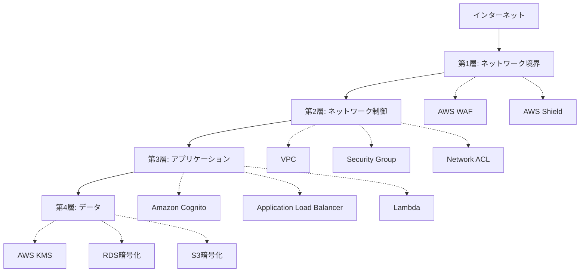
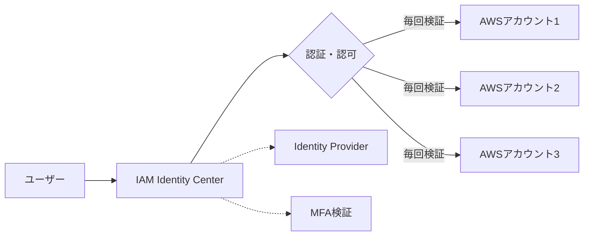
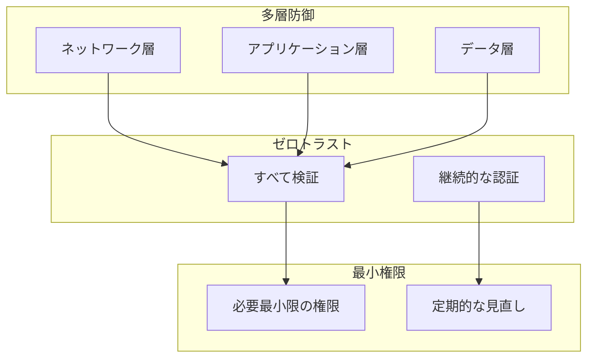

# セキュリティの基本原則

セキュリティ設計の基礎となる3つの重要な原則について学びます。これらはAWS環境を含むあらゆるシステムで適用される普遍的な考え方です。

## 1. 多層防御 (Defense in Depth)

### 概念

多層防御は、単一の防御層に依存せず、複数の独立した防御層を重ねることでセキュリティを強化する戦略です。

**重要な考え方:**

- 1つの防御が突破されても、他の層が攻撃を防ぐ
- 各層は独立して機能し、異なる種類の脅威に対応
- 完全な防御は不可能という前提に立つ

### AWS環境での実装例



#### 各層の役割

**第1層: ネットワーク境界**

- AWS Shield: DDoS攻撃からの保護
- AWS WAF: Webアプリケーションへの攻撃をフィルタリング
- CloudFront: オリジンサーバーの隠蔽とShield/WAF統合の基盤

**第2層: ネットワーク制御**

- VPC: 論理的に分離されたネットワーク空間
- Security Group: インスタンスレベルのステートフルファイアウォール
- Network ACL: サブネットレベルのステートレスファイアウォール

**第3層: アプリケーション**

- IAM: きめ細かいアクセス制御
- Amazon Cognito: ユーザー認証・認可
- ALB: アプリケーション層でのルーティングとセキュリティ

**第4層: データ**

- AWS KMS: 暗号化キーの管理
- RDS暗号化: データベースの保管時暗号化
- S3暗号化: オブジェクトストレージの暗号化

### 実践のポイント

!!! tip "多層防御の実装ポイント"
    - **各層を独立させる**: 1つの設定ミスが全体を危険にさらさない
    - **異なる種類の防御を組み合わせる**: ネットワーク制御だけでなく、認証・暗号化も
    - **監視を各層に配置**: CloudWatch、GuardDuty、Security Hubで異常を検知

!!! warning "よくある失敗"
    - Security Groupだけに頼り、アプリケーション層の認証が甘い
    - WAFを導入したが、VPC内部の通信は無防備
    - 暗号化をしているが、キー管理が不適切

## 2. 最小権限の原則 (Principle of Least Privilege)

### 概念

ユーザーやシステムには、業務に必要な最小限の権限のみを付与する原則です。

**重要な考え方:**

- デフォルトは「すべて拒否」から始める
- 必要なものだけを明示的に許可
- 定期的に権限を見直し、不要なものは削除

### AWS環境での実装

#### IAMポリシーの例

❌ **悪い例: 過剰な権限**

```json
{
  "Version": "2012-10-17",
  "Statement": [
    {
      "Effect": "Allow",
      "Action": "s3:*",
      "Resource": "*"
    }
  ]
}
```

すべてのS3バケットに対してすべての操作を許可している。

✅ **良い例: 最小権限**

```json
{
  "Version": "2012-10-17",
  "Statement": [
    {
      "Effect": "Allow",
      "Action": [
        "s3:GetObject",
        "s3:PutObject"
      ],
      "Resource": "arn:aws:s3:::my-app-bucket/uploads/*"
    }
  ]
}
```

特定のバケットの特定のプレフィックス配下で、読み書きのみを許可。

#### Service Control Policy (SCP)での組織全体の制限

```json
{
  "Version": "2012-10-17",
  "Statement": [
    {
      "Effect": "Deny",
      "Action": [
        "ec2:RunInstances"
      ],
      "Resource": "*",
      "Condition": {
        "StringNotEquals": {
          "ec2:InstanceType": [
            "t3.micro",
            "t3.small",
            "t3.medium"
          ]
        }
      }
    }
  ]
}
```

組織全体で、特定のインスタンスタイプ以外の起動を禁止。コスト管理とセキュリティを両立。

### 実践のポイント

!!! tip "最小権限の実装ポイント"
    - **IAM Access Analyzer**: 未使用の権限を検出
    - **一時的な権限付与**: AWS STS (Security Token Service)で短期間の認証情報を発行
    - **ロールベースのアクセス制御**: ユーザーではなくロールに権限を付与

!!! example "段階的な権限付与の例"
    1. 開発環境: 開発者に広めの権限 (デバッグのため)
    2. ステージング環境: 限定的な権限で本番に近い状態をテスト
    3. 本番環境: 厳格な最小権限、変更は承認プロセスが必要

## 3. ゼロトラスト (Zero Trust)

### 概念

「信頼しない、常に検証する」という前提に立ち、ネットワークの内部・外部を問わず、すべてのアクセスを検証する考え方です。

**従来のモデルとの違い:**

| 従来の境界防御モデル | ゼロトラストモデル |
|---|---|
| ネットワーク内部は信頼 | 内部・外部問わず検証 |
| VPN接続すれば全リソースにアクセス可能 | リソースごとに認証・認可 |
| ユーザーベースの認証 | ユーザー + デバイス + コンテキストで認証 |

### AWS環境での実装

#### 1. IAM Identity Center (旧AWS SSO)

すべてのAWSアカウントへのアクセスを一元管理:

- シングルサインオン (SSO)
- 多要素認証 (MFA) の強制
- セッションごとの認証
- 外部Identity Provider (Okta, Azure AD等) との統合



#### 2. リソースごとの認証

Lambda関数の例:

```python
import boto3
import json

def lambda_handler(event, context):
    # リクエストごとに認証トークンを検証
    token = event['headers'].get('Authorization')

    if not verify_token(token):
        return {
            'statusCode': 401,
            'body': json.dumps('Unauthorized')
        }

    # ユーザー属性に基づいてアクセス可能なデータを制限
    user_id = get_user_id_from_token(token)

    # 最小権限でDynamoDBにアクセス
    dynamodb = boto3.resource('dynamodb')
    table = dynamodb.Table('Users')

    # ユーザー自身のデータのみ取得
    response = table.get_item(
        Key={'userId': user_id}
    )

    return {
        'statusCode': 200,
        'body': json.dumps(response['Item'])
    }
```

### 実践のポイント

!!! tip "ゼロトラストの実装ポイント"
    - **継続的な検証**: 一度認証したら終わりではなく、セッションごとに検証
    - **コンテキスト評価**: IPアドレス、MFA状態などの条件で制御
    - **マイクロセグメンテーション**: Security Groupでリソース間通信を最小限に制限

!!! example "コンテキストベースのアクセス制御例"
    ```json
    {
      "Condition": {
        "IpAddress": {
          "aws:SourceIp": "203.0.113.0/24"
        },
        "Bool": {
          "aws:MultiFactorAuthPresent": "true"
        }
      }
    }
    ```

    特定のIPアドレスから、MFA認証済みの場合のみアクセス許可。

## 3つの原則の関係

これらの原則は独立しているのではなく、互いに補完し合います:



- **多層防御**: 各層でゼロトラストと最小権限を適用
- **ゼロトラスト**: 検証の際に最小権限の原則を適用
- **最小権限**: 多層防御の各層で適切な権限を設定

## まとめ

| 原則 | 目的 | AWS実装例 |
|---|---|---|
| 多層防御 | 単一障害点の排除 | WAF + Security Group + IAM + 暗号化 |
| 最小権限 | 侵害時の影響範囲を最小化 | IAMポリシー、SCP、リソースベースポリシー |
| ゼロトラスト | 内部からの脅威にも対応 | IAM Identity Center、リソースごとの認証 |

これらの原則を理解したら、次は具体的なリスク評価とコスト最適化について学びましょう。

[リスク管理とコスト最適化を学ぶ →](risk-and-cost.md){ .md-button .md-button--primary }
