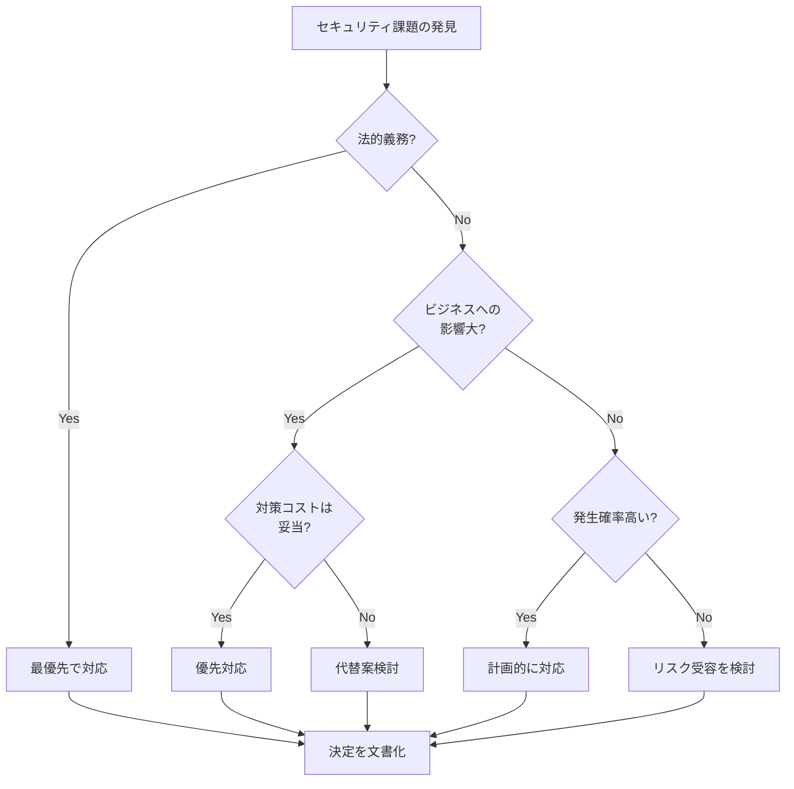

# リスク管理とコスト最適化

セキュリティ対策には必ずコストが伴います。このページでは、リスクを現実的に評価し、ビジネス要件とコストのバランスを取る方法を学びます。

## 基本的な考え方

### 完全なセキュリティは存在しない

どんなに強固なセキュリティ対策を講じても、100%安全なシステムは存在しません。重要なのは、**許容できるリスクレベルを見極める**ことです。

これは業界標準のセキュリティフレームワークでも認識されている前提です：

- **NIST Cybersecurity Framework**: [Five Functions](https://www.nist.gov/cyberframework/online-learning/five-functions)が保護(Protect)だけでなく、検知(Detect)・対応(Respond)・復旧(Recover)を含むことは、侵害の発生を前提としたリスクベースのアプローチを示している

### セキュリティ投資の判断基準

セキュリティ対策は**コスト vs リスク**のトレードオフです:

| 要素 | 考慮点 |
|---|---|
| **リスクの大きさ** | 発生確率 × ビジネスインパクト |
| **対策コスト** | 初期費用 + 運用費用 + 人的コスト |
| **投資対効果** | リスク軽減額 vs 対策コスト |

## リスクベースのアプローチ

### 1. リスクの識別と評価

#### リスクマトリックス

リスクを「発生確率」と「影響度」で評価します:

|  | **高確率** | **低確率** |
|---|---|---|
| **高影響** | 🔴 **最優先対応**<br/>即座に対策が必要<br/>例: SQLインジェクション、認証の脆弱性 | 🟡 **対策を検討**<br/>コストと照らし合わせて判断<br/>例: 大規模DDoS攻撃、DR対策 |
| **低影響** | 🟠 **効率的に対応**<br/>自動化や段階的対応<br/>例: ログ保持期間の短さ、監視の不足 | 🟢 **受容も選択肢**<br/>他の対策を優先<br/>例: 開発環境のパッチ適用遅延 |

#### 実践例: Webアプリケーションのリスク評価

| 脅威 | 発生確率 | 影響度 | リスクレベル | 対応 |
|---|---|---|---|---|
| SQLインジェクション | 高 | 高 | **極めて高** | 即座に対策 |
| DDoS攻撃 | 中 | 高 | **高** | AWS Shield導入 |
| 古いNode.jsバージョン | 低 | 中 | **中** | 計画的に更新 |
| 開発環境への不正アクセス | 低 | 低 | **低** | IPアドレス制限で対応 |

### 2. ビジネスインパクトの評価

技術的なリスクをビジネス影響に翻訳します:

#### 評価の観点

**財務的影響**

- システム停止による機会損失
- データ漏洩時の賠償金
- 復旧コスト

**評判への影響**

- 顧客の信頼喪失
- ブランド価値の低下
- 報道による悪影響

**法的影響**

- GDPR、個人情報保護法違反の罰金
- 訴訟リスク

#### 計算例

```
Webサイトのダウンタイムコスト計算:

時間あたりの売上: 100万円
平均復旧時間: 4時間
年間発生回数: 2回

年間予想損失 = 100万円 × 4時間 × 2回 = 800万円

→ 800万円以下の対策コストなら投資対効果あり
```

### 3. 現実的な脅威の評価

**よくある過剰な心配:**

- ゼロデイ攻撃を受ける
- 国家レベルのハッカーに狙われる

**実際に多い脅威:**

- 設定ミス（S3バケットのPublic公開など）
- 古い依存ライブラリの脆弱性
- 弱いパスワード・認証情報の漏洩
- 内部関係者による誤操作

!!! warning "脅威モデリングの現実"
    スタートアップや中小企業が最初に対策すべきは、高度な攻撃ではなく**基本的なセキュリティ衛生**です:

    - MFAの有効化
    - 最小権限の原則の適用
    - 定期的なパッチ適用
    - バックアップの自動化

## セキュリティとコストのバランス

### AWSセキュリティサービスのコスト一覧

各サービスの月額コスト概算（公式料金ページに基づく、詳細は[AWSセキュリティサービスの詳細料金情報](#aws_1)を参照）:

| サービス | 小規模環境 | 中規模環境 | 目的 |
|---|---|---|---|
| IAM / Security Group | 無料 | 無料 | アクセス・ネットワーク制御 |
| CloudTrail (基本) | 無料 | 無料 | API監査ログ（単一証跡） |
| Shield Standard | 無料 | 無料 | 基本DDoS保護 |
| GuardDuty | 約1,500-2,000円 | 約15,000-22,500円 | 脅威検知 |
| AWS Config | 約1,200-1,500円 | 約11,250-15,000円 | 構成管理・コンプライアンス |
| CloudTrail (全リージョン) | 約0-300円 | 約3,000-4,500円 | 詳細監査ログ |
| WAF | 約1,500-2,000円 | 約3,000-4,500円 | Webアプリ保護 |
| Security Hub | 約750-1,500円 | 約7,500-11,250円 | セキュリティ標準評価・統合管理 |
| KMS | 約150円/キー | 約150-450円/キー | データ暗号化 |
| Shield Advanced | 約45万円/月 | 約45万円/月〜 | 高度DDoS保護 + 24/7サポート |

!!! note "コスト前提条件"
    - **小規模**: リソース10-50、CloudTrailイベント10万/月、VPC Flow 10GB/月
    - **中規模**: リソース100-500、CloudTrailイベント100万/月、VPC Flow 100GB/月
    - **WAF小規模**: Web ACL 1個 + ルール5個 + 100万リクエスト/月
    - **WAF中規模**: Web ACL 1個 + ルール10個 + 1,000万リクエスト/月
    - **Security Hub小規模**: 5,000チェック/月
    - **Security Hub中規模**: 50,000チェック/月 + 30,000取り込みイベント/月
    - 料金は米ドル→円換算（1ドル=150円）で概算

### サービス導入の分類

AWSセキュリティサービスは、推奨度合いと導入要件によって以下のように分類できます（詳細な根拠は[参考資料](#_19)を参照）:

**無料の基本サービス（すべての環境で必須）**:

- IAM / Security Group / CloudTrail (基本) / Shield Standard

**AWS公式が全環境で推奨**:

- **GuardDuty**: 「すべてのサポートされているAWSリージョンで有効化することを強く推奨」（[AWS公式ベストプラクティス](#_19)参照）
- **AWS Config + Security Hub**: CIS AWS Foundations Benchmarkで推奨される構成管理とセキュリティ標準評価（[CIS Benchmark](#_19)参照）
    - **AWS Config**: 構成変更の記録と監視（全アカウント・全リージョン）
    - **Security Hub**: AWS FSBP、CIS Benchmark、PCI DSS等の自動評価とFindings統合管理
    - 注: Security Hubは月10,000イベントまで永続無料枠あり

**要件ベースで選択**:

- **WAF**: インターネット公開アプリケーションがある場合
    - AWS公式ブログ「The three most important AWS WAF rate-based rules」で全Web ACLへのレートベースルール導入を推奨（[WAFベストプラクティス](#_19)参照）
    - PCI DSS 4.0: 2025年3月31日から公開Webアプリケーションへの自動防御ソリューション（WAF等）が必須（Requirement 6.4.2）（[PCI DSS要件](#_19)参照）
- **KMS**: 機密データの暗号化が必要な場合
- **Shield Advanced**: ビジネスクリティカルなアプリケーションで大規模DDoS攻撃リスクが高い場合
    - 月額45万円（$3,000）、1年契約必須（年間約540万円）
    - 検討基準: ダウンタイムのビジネスコスト > 月額45万円

## リスク許容の判断プロセス

### 1. ステークホルダーの特定

| ステークホルダー | 関心事 |
|---|---|
| **経営層** | ビジネス継続性、評判リスク、法的リスク |
| **技術責任者** | システムの安定性、セキュリティ品質 |
| **法務・コンプライアンス** | 法規制遵守、契約上の義務 |
| **財務** | コスト管理、ROI |

### 2. リスク受容の文書化

リスクを受容する場合は、必ず文書化します:

#### リスク受容書のテンプレート例

```markdown
# リスク受容書

## リスク概要
- **識別番号**: RISK-2024-001
- **リスク内容**: 開発環境のRDSインスタンスが暗号化されていない
- **発見日**: 2024-01-15

## リスク評価
- **発生確率**: 低 (内部ネットワークのみアクセス可能)
- **影響度**: 低 (本番データを含まない)
- **リスクレベル**: 低

## 受容理由
- 開発環境は本番データを含まない
- Security Groupで内部IPのみアクセス許可
- 暗号化有効化によるパフォーマンス低下を避ける
- 暗号化コスト(約3,000円/月)を節約

## 代替コントロール
- VPC内部のみアクセス可能
- 定期的なデータの削除(週次)
- アクセスログの監視

## 承認
- **技術責任者**: 山田太郎 (承認日: 2024-01-20)
- **セキュリティ責任者**: 佐藤花子 (承認日: 2024-01-20)

## レビュー予定日
- 次回レビュー: 2024-07-01 (6ヶ月後)
```

### 3. 定期的な見直し

リスク環境は変化するため、定期的な見直しが必要です。例えば、AWS環境では以下のような変化がリスクに影響します:

- **新しいAWSサービスの追加**: Lambda、ECS等の新機能導入によるアーキテクチャ変更
- **GuardDutyの新しい検知タイプ**: 新たな脅威パターンへの対応が可能に
- **コンプライアンス要件の変更**: PCI DSS等の新バージョンリリース
- **セキュリティインシデントの発生**: 実際の攻撃から学ぶ脆弱性

| レビュー頻度 | 対象 | AWS環境での具体例 |
|---|---|---|
| **四半期ごと** | 高リスク項目 | IAM権限レビュー、Security Hub Findingsの傾向分析 |
| **半年ごと** | 中リスク項目 | WAFルールの有効性確認、GuardDuty設定の見直し |
| **年1回** | 低リスク項目 | 全体的なアーキテクチャレビュー、コスト最適化 |
| **臨時** | 重大インシデント発生時、システム変更時 | 新リージョン追加時、新サービス導入時、AWS障害発生時 |

!!! note "レビュー頻度について"
    上記の頻度は一例です。組織の規模、リスク環境、業界特性、コンプライアンス要件などに応じて適切に調整してください。

## 実践的な意思決定フレームワーク

### セキュリティ対策の優先順位付け



### 判断例

!!! example "ケーススタディ: WAF導入の判断"
    **状況**:

    - ECサイト(月商500万円)
    - 現在DDoS攻撃は受けていない
    - WAFコスト: 約1万円/月(年間12万円)

    **判断プロセス**:

    1. **ビジネスインパクト**: サイト停止で1日あたり約16万円の損失
    2. **攻撃確率**: 中規模ECサイトでは年1-2回程度
    3. **予想損失**: 16万円 × 2日 × 1回 = 32万円/年
    4. **投資対効果**: 32万円(損失) vs 12万円(対策コスト) → **導入すべき**

    **結論**: WAF導入を承認

!!! example "ケーススタディ: 古いライブラリの脆弱性"
    **状況**:

    - 管理画面で使用しているライブラリにMedium脆弱性
    - 管理画面は社内IPからのみアクセス可能
    - 更新にはQA含め2人日必要(約10万円)

    **判断プロセス**:

    1. **リスク評価**: 内部ネットワークのみアクセス、Medium重大度
    2. **代替コントロール**: IPアドレス制限、VPN必須
    3. **緊急性**: 低(ただし放置はNG)

    **結論**: 次回の定期メンテナンスで対応(3ヶ月後)、リスク受容書を作成

## AWSセキュリティサービスの詳細料金情報

実際のコストを見積もる際は、以下の公式料金ページを参照してください:

### 主要サービスの料金ページ

| サービス | 公式料金ページ | 料金体系の特徴 |
|---|---|---|
| **GuardDuty** | [aws.amazon.com/guardduty/pricing](https://aws.amazon.com/guardduty/pricing/) | CloudTrailイベント・VPC Flow・DNS別課金、30日無料トライアル |
| **Config** | [aws.amazon.com/config/pricing](https://aws.amazon.com/config/pricing/) | Configuration Item・ルール評価別課金 |
| **Security Hub** | [aws.amazon.com/security-hub/pricing](https://aws.amazon.com/security-hub/pricing/) | セキュリティチェック・Finding取り込み別課金、10,000イベント/月は永続無料 |
| **WAF** | [aws.amazon.com/waf/pricing](https://aws.amazon.com/waf/pricing/) | Web ACL・ルール・リクエスト別課金 |
| **Shield** | [aws.amazon.com/shield/pricing](https://aws.amazon.com/shield/pricing/) | Standard無料、Advanced月額$3,000（1年契約） |
| **KMS** | [aws.amazon.com/kms/pricing](https://aws.amazon.com/kms/pricing/) | キー月額$1.00、API呼び出し$0.03/10,000リクエスト |
| **CloudTrail** | [aws.amazon.com/cloudtrail/pricing](https://aws.amazon.com/cloudtrail/pricing/) | 最初の証跡無料、データイベント$0.10/10万イベント |

### コスト見積もりツール

!!! tip "料金計算ツール"
    - **AWS Pricing Calculator**: [calculator.aws](https://calculator.aws/)
    - 複数のAWSサービスを組み合わせた正確な見積もりが可能
    - リージョン別の料金差も反映

### リージョン別料金の注意点

このドキュメントで示したコスト概算は、米国東部（バージニア北部）の料金を基準に、1ドル=150円で換算しています。
東京リージョン（ap-northeast-1）では一部サービスで料金が異なる場合があるため、正確な見積もりには公式料金ページの確認が必要です。

### 参考資料

本セクションの作成にあたり、以下の公式ドキュメントを参照しました:

- [AWS GuardDuty Best Practices](https://aws.github.io/aws-security-services-best-practices/guides/guardduty/) - GuardDutyの全リージョン有効化推奨
- [Getting started with GuardDuty - AWS Documentation](https://docs.aws.amazon.com/guardduty/latest/ug/guardduty_settingup.html) - GuardDuty公式セットアップガイド
- [CIS AWS Foundations Benchmark](https://docs.aws.amazon.com/securityhub/latest/userguide/cis-aws-foundations-benchmark.html) - AWS Config全リージョン有効化推奨
- [Operational Best Practices for CIS AWS Foundations Benchmark](https://docs.aws.amazon.com/config/latest/developerguide/operational-best-practices-for-cis_aws_benchmark_level_1.html) - CIS Benchmark実装ガイド
- [The three most important AWS WAF rate-based rules](https://aws.amazon.com/blogs/security/three-most-important-aws-waf-rate-based-rules/) - WAFレートベースルールのベストプラクティス
- [Using rate-based rule statements in AWS WAF](https://docs.aws.amazon.com/waf/latest/developerguide/waf-rule-statement-type-rate-based.html) - WAFレートベースルール公式ドキュメント
- [PCI Web Application Security Requirements](https://pcidssguide.com/pci-web-application-security-requirements/) - PCI DSS要件解説
- [How Does PCI DSS 4.0 Affect Web Application Firewalls?](https://www.tripwire.com/state-of-security/how-does-pci-dss-40-affect-web-application-firewalls) - PCI DSS 4.0のWAF要件

## まとめ

### リスク管理の5原則

1. **完璧を目指さない**: 100%のセキュリティは不可能
2. **ビジネス視点で判断**: 技術的リスクをビジネス影響に翻訳
3. **コストを意識する**: 費用対効果を考慮し、限られた予算を適切に配分する
4. **文書化する**: すべてのリスク判断を記録
5. **定期的に見直す**: リスク環境は常に変化する

基本原則とリスク管理を理解したら、次は具体的な予防的対策について学びましょう。

[アクセス制御とデータ保護を学ぶ →](access-control.md){ .md-button .md-button--primary }
